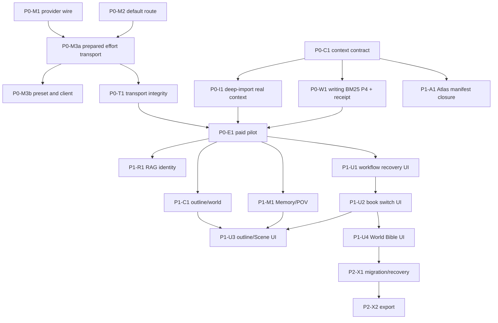

# 项目评估图谱：修复与优化交接计划

> 状态：实施中；只有下方“实施进度”中带提交与门禁证据的条目才记作已完成能力。
> 诊断基线：2026-09-01，`main@d4d8f4858e103055779057b7d8e23adbb09bf42d`。
> 事实附件：[项目评估图谱 Excel](../../../outputs/01a05ade-6b8d-7f02-bfaa-2d4e3f2df08c/novelAssist-dsh-项目评估图谱-2026-09-01.xlsx)。
> 长期能力台账：[功能对照清单](./功能对照清单.md)；既有里程碑：[后续开发计划](./后续开发计划.md)。

## 0. 实施进度

| 批次 | 工作包 | 状态 | 提交 | 独立复审 | 证据 |
|---|---|---|---|---|---|
| 1 | P0-M1 provider wire | 已完成 | `85a41e41` | `approve`；补异常降级与真实 shape 残留测试 `ff8611f2` | client 55/55；全仓 16/16 |
| 1 | P0-M2 默认模型迁移 | 已完成 | `ffb624a3` | `approve`；补显式用户 route 保持测试 `ff8611f2` | Config/starter/client 一致；无 operational `deepseek-chat` |
| 1 | 测试稳定性前置 | 已完成 | `35c8914a` | `approve` | world 153/153；不删覆盖 |
| 2 | P0-M3a reasoning transport / effective receipt | 已完成 | `ede4c033` | `approve`；中间件异常回执补齐 `b6aa09ea` | registration-bound `prepareCall`；requested/effective/source/context 回执 |
| 2 | P0-M3b 内容卡、存储与 client | 已完成 | `0bc407d2` | `approve`；修复 prospective route 优先级与 null 继承校验 `b6aa09ea` | live exact-model 枚举；未知 effort 零写；合法卡下次 receipt 为实际值 |
| 3 | P0-C1 可审计 Context 入口 | 已完成 | `a0b49b68` | `approve`；补 Unicode/JSON 边界、完整 source tuple 与 prototype-safe 投影 `d53ab2dc` | 唯一 rendered text 估算硬上限；actual manifest/双 hash/range/omission |
| 3 | P1-A1 Atlas actual-input manifest | 已完成 | `501d8dcb` | `approve`；补跨地点同源唯一性、空证据、Unicode 与 page CAS hash `d53ab2dc` | trim 后 manifest；packet/manifest/hash 闭合；只有地点名 provider=0 |
| 4 | P0-I1 深导结构真实 Context | 已完成 | `c130025f` | `approve`；补 legacy provider 后漂移与 durable materialize 窗口复核 `0d9bf43f` | 本 workflow Scene/去重正文/pending/reused canonical；空证据 provider=0；Phase 3 receipt |
| 4 | P0-W1 写作 BM25 P4 与冻结回执 | 已完成 | `d28e2028` | `approve`；移除公开 legacy 裸输入，补 run 防覆盖、回执重验、路径与排序边界 `0d9bf43f` | `{run_id,proposal_id}` 唯一公开生成输入；provider 前后/采用前漂移零 canonical 写 |
| 4 | 全仓重型测试调度 | 已完成 | `10051b84` | `approve` | 不放宽 timeout；5 个真实 Git 重型 workspace 串行；全仓 16/16 |
| 5–7 | 其余工作包 | 待实施 | — | — | 不以计划代替实现 |

批次 1 最终门禁：`check:deps`、`check:git-writers`、`check:distribution`、`check:audit-gate`、
`npm run build`、`npm test`（16/16 workspace）、`npm run typecheck`、`git diff --check` 全部通过。
父仓库未改；已有用户显式配置未被重写；既存未跟踪测试副本未触碰。

批次 2 最终门禁：四项 `check:*`、`npm run build`、`npm test`（16/16 workspace）、
`npm run typecheck`、`git diff --check` 全部通过。独立复审发现并关闭 3 个 Major：
prospective route 必须在宿主按 `Config < preset < llm.yml` 组合、清除书级 effort 前必须校验
继承后的实际值、`prepareCall()` 后中间件异常也必须保留 secret-free receipt。
本批未调用付费模型，未改父仓库，未触碰既存未跟踪测试副本。

批次 3 最终门禁：四项 `check:*`、`npm run build`、`npm test`（16/16 workspace；
Context 11 tests；World 158 tests）、`npm run typecheck`、`git diff --check` 全部通过。
独立复审发现并关闭 7 个 Major：Context hash/source/Unicode/prototype 边界，
以及 Atlas 跨地点同源歧义、actual packet hash、空证据 selector 占位和 derived RAG Unicode。
旧 `compileContext()` 与旧 SourceRef 读取保持兼容；批次 3 只完成共享合同，随后已由批次 4
接入 writing/imports。本批未调用付费模型，未改父仓库。

批次 4 最终门禁：四项 `check:*`、`npm run build`、`npm test`（16/16 workspace；
Imports 180 tests；World 158 tests；Writing 97 tests）、`npm run typecheck`、`git diff --check`
全部通过。独立复审发现并关闭 7 个问题：公开 capability 仍暴露旧 title/premise、legacy Phase 3
缺 provider 后漂移复核、durable materialize 的 TOCTOU、proposal run 覆盖、冻结回执字段篡改、
proposal 路径 containment/symlink 以及 locale 排序不确定。全仓测试没有放宽 timeout，而是以
`10051b84` 串行调度真实 Git 重型 workspace，消除资源争用假失败。本批未调用付费模型，
未改父仓库，未触碰既存未跟踪测试副本。

## 1. 交接目标

把本轮“项目内部诊断 + 外部模型规格核对”转成后续 Agent 可以逐项执行、逐项验收的工作包，解决五个问题：

1. 当前默认模型与 DSH 真实执行能力不一致；
2. 通用上下文编译器存在，但复用范围、来源回执和预算合同不足；
3. 深度导入结构分析没有收到真实 Scene/对象资料；
4. RAG、Memory、POV 和作者工作台存在“有原语、缺消费闭环”；
5. 项目没有足以证明 DeepSeek V4 Flash 小说质量的真实评测。

本文的权威顺序是：当前源码与行为测试 > 已提交契约/ADR > 本文 > Excel 评分与历史台账。实现时若代码已变化，先刷新证据，不照抄旧行号或数量。

## 2. 先给结论

| 决策 | 结论 | 原因 |
|---|---|---|
| 修复顺序 | 先正确性，再质量，再覆盖面 | 模型看不到资料时，调参数和换模型都无法解释结果 |
| 上下文架构 | 只保留一个通用 `@novelcraft/context`；Atlas 保留领域选择器 | 两者职责不同；应共享预算、manifest、hash、open target 原语，不重写 Atlas |
| 接线策略 | 按工作流选择性接入，不给核心包全部 29 个实际 `runStep()` 调用点强塞统一上下文 | review、rerank、单 Scene 抽取等步骤本来就需要局部输入 |
| 默认模型 | 将已退役的 `deepseek-chat` 默认值迁到 `deepseek-v4-flash`，但标记为“待项目评测确认的默认” | 旧别名已失效；官方通用 benchmark 不能证明小说建议质量 |
| 思考等级 | 打通 DSH 已支持的 `reasoningEffort`，但选项只认 live adapter；内置 V4 预设移除 thinking 下无效的 `temperature` | 官方能力不等于当前 adapter 已暴露能力；thinking 下 `temperature/top_p` 等 sampling 参数无效 |
| 评测方式 | 结构化硬门 + 作者盲评；官方 benchmark 只作外部参考 | “优秀建议”是项目任务结果，不能从上下文长度或厂商分数推导 |
| 数据与写入 | 继续以文件 + Git 为真相；候选先落 pending，canonical adopt 必过 approval | 遵守仓库铁律，不新增数据库、队列或旁路写面 |

## 3. 当前事实快照

### 3.1 P0/P1 问题台账

| ID | 优先级 | 当前事实 | 用户影响 | 证据锚点 | 必要性 |
|---|---|---|---|---|---|
| F-01 | P0 | DSH、client、starter 多处默认仍是 `deepseek-chat` | 新安装或兜底路由会选择已退役模型名 | `packages/novelcraft/dsh/src/config.ts`、`packages/novelcraft/client/src/rpc.ts`、`starter/dev-profile/cordis.patch.yml` | 必须 |
| F-02 | P0 | `DshProvider` 未把思考等级传给 `GenerateOptions.reasoningEffort`；当前 DSH DeepSeek adapter 声明 `off/high/max` | 内容卡或工作流不能控制已声明等级；现有 effective receipt 也无法证明 adapter 最终默认值 | `packages/novelcraft/dsh/src/llm/provider.ts`、`packages/novelcraft/llm-step/src/types.ts`、上游 `config-catalog.md` | 必须 |
| F-03 | P0 | DeepSeek V4 内置内容卡（writing-day/import-day/polish）仍设置 `temperature`，thinking 默认开启时该参数无效；无卡携带 `top_p`（presets 已有意不带不可执行参数） | UI/配置看似生效，实际不改变模型行为 | `packages/novelcraft/llm-step/src/presets.ts` | 必须 |
| F-04 | P0 | client 把 `listProviders(): LlmProviderInfo[]` 强转为 `string[]`；测试替身也返回字符串 | 真实宿主会把对象数组送到字符串 wire，模型卡可用 provider 列表失真 | `packages/novelcraft/client/src/rpc.ts:listAvailableProviders`、`node_modules/@deepseek-ai/dsh-llm/lib/types/types.d.ts:LlmProviderInfo` | 必须 |
| F-05 | P0 | 通用编译器只有 writing 的 propose/generate 链消费；P4 没有生产者 | “已接上下文”目前只代表四类静态资料经过裁剪，不代表 RAG/Memory 已进入写作 | `packages/novelcraft/writing/src/propose.ts:compileProposalContextBudgeted` | 必须 |
| F-06 | P0 | 编译器测试允许 `total_tokens <= budget + 64`；截断后可能超过硬预算 | 大输入可突破合同，真实模型边界不可预测 | `packages/novelcraft/context/src/context.ts`、`packages/novelcraft/context/test/context.test.ts` | 必须 |
| F-07 | P0 | `selected_asset_ids` 实际写入 section 名；没有 source hash、manifest、snapshot/open target | 无法回答“模型实际看了什么”，也无法可靠检测漂移 | `packages/novelcraft/context/src/context.ts:CompiledContext` | 必须 |
| F-08 | P0 | `planStructureAnalysis` 已留 `context?: string` seam，但 legacy/durable 两条编排的 Phase 3 调用均未供应，默认只发送“请基于已导入 Scene 与世界对象……”一句话 | 结构分析模型没有拿到要分析的 Scene/对象正文 | `packages/novelcraft/imports/src/structure.ts:140/149`、`orchestrate.ts:417`、`deep-import-workflow.ts:649` | 必须 |
| F-09 | P1 | `phase1aContext` 有参数，但 legacy/durable 两条调用均未提供 | 是未接线 seam；尚无证据证明切 Scene 需要额外上下文 | `packages/novelcraft/imports/src/stages.ts:sliceChapterBatch` | 条件性；先不接 |
| F-10 | P1 | RAG 只被 Atlas 和公开 `rag_search` 消费；向量未统一校验 finite、维度、模型身份 | 旧模型/坏向量可能参与排序；写作链还没有 P4 | `packages/novelcraft/rag/src/search.ts`、`embed.ts`、`sync.ts` | 应做 |
| F-11 | P1 | Memory 唯一生产消费者是 store 的 Chapter Dossier 投影；POV 读面在 store（dossier 投影 + frontmatter `pov_character_id`），生成/审查链无消费合同 | 作者能看见状态，但模型不一定遵守角色知识边界 | `packages/novelcraft/store/src/dossier.ts`、`frontmatter.ts`、`packages/novelcraft/memory/src/memory.ts` | 应做 |
| F-12 | P1 | client 有章节、Inbox、Story Map、Writing Desk、Atlas；没有 book/workflow/outline/world 专门工作区 | 已有工具仍主要依赖 Agent 对话调用，作者缺少可视化入口 | `packages/novelcraft/client/src/wire.ts:ENDPOINTS`、`src/client/*` | 应做，但晚于正确性 |
| F-13 | P2 | 无正式发布/导出和已验证整书迁移闭环 | Demo 可创作，但交付与跨机恢复不完整 | 《功能对照清单》§6.13/§6.15 | 后做 |
| F-14 | P0 | provider response 只保留 input/output usage，finish、reasoning/cache usage 和“最终生效 effort”未闭合 | 付费评测可能把空文本、max-token 终止或参数未生效误记为成功 | `packages/novelcraft/llm-step/src/types.ts`、`packages/novelcraft/dsh/src/llm/provider.ts` | 评测前必须 |
| F-15 | P1 | Atlas 在 trim 前收集 manifest，可能保留未送入 packet 的来源 | 来源回执与模型实际输入不闭合 | `packages/novelcraft/world/src/map-atlas/context.ts`、`map-atlas-context.test.ts` | 应做 |

### 3.2 DeepSeek 当前规格快照

核对日期为 2026-09-01，只把与本项目决策直接相关的事实写入交接：

- `deepseek-v4-flash` 当前版本为 DeepSeek-V4-Flash-0731，1M context、最大 384K 输出，支持 JSON、Tool Calls、Responses API 与 Anthropic API；
- thinking 默认开启，默认 effort 为 `high`；官方实际等级为 `low/high/max`，请求 `medium/xhigh` 会映射为 `high`；
- thinking 模式下 `temperature`、`top_p`、`presence_penalty`、`frequency_penalty` 无效，兼容层不会报错；
- `deepseek-chat` 与 `deepseek-reasoner` 已公告于 2026-07-24 停用；
- 本地 DSH rc.8 的 `GenerateOptions` 已有 `reasoningEffort`；DeepSeek adapter 的 `off/high/max` 声明目前只来自 vendored `config-catalog.md`（`@deepseek-ai/dsh-llm-deepseek` 未随本地 rc.8 安装），M3a 实施时以运行时 registration-bound `prepareCall()` 的返回复核为准。NovelCraft 必须按 `prepareCall()` 返回的 exact-model 能力与 effective config 执行；官方支持的 `low` 在 adapter 暴露前不能作为项目验收项，`off` 也不能冒充 `low`。

官方来源：[模型与价格](https://api-docs.deepseek.com/quick_start/pricing/)、[Thinking Mode](https://api-docs.deepseek.com/guides/thinking_mode/)、[Change Log](https://api-docs.deepseek.com/updates/)。其他厂商的当日规格与价格保留在 Excel 的 `05_AI平台`、`06_模型适配`，不复制到本文，避免两份快照同步漂移。

## 4. 目标闭环

```mermaid
flowchart LR
  A[作者任务] --> B[领域选择器\nwriting/imports/outline/world]
  B --> C[@novelcraft/context\n估算器硬上限 + actual manifest]
  R[RAG 检索] --> B
  M[Memory / POV 投影] --> B
  C --> D[冻结 context hash\nbase hash / proposal run]
  D --> E[llm-step\nschema + effort + budget + journal]
  E --> F[待处理候选 / review receipt]
  F --> G{来源与基线仍一致?}
  G -- 否 --> H[标记 stale\n要求重新生成]
  G -- 是 --> I{作者 approval}
  I -- allowed-once --> J[目标路径事务 + Git commit]
  I -- 其他 --> K[零 canonical 写]
```

边界说明：

- 通用 context 负责排序、裁剪、manifest 与 hash，不负责知道“小说世界里哪些资料相关”；
- writing/imports/outline/world 各自保留小型领域选择器；
- Atlas 现有 selector 继续负责地点、世界书页和空间 RAG，只复用通用合同，不迁成第二个 generic compiler；
- provider 输出只产生候选或回执，不直接成为正史。

## 5. 执行纪律

1. 每个工作包独立提交；只在本仓 `main` 落地，不改只读父仓库。
2. 先补会失败的行为测试，再改共享根因；不在每个调用点各写一套 guard。
3. 核心包接口只做加法：新增安全函数/字段，旧导出保留；公开 DSH 能力切到安全函数。
4. 所有改变模型可见输入的改动必须进入 hash/journal/trace，做到“模型可见等于可回放”。
5. 不为计划项预建数据库、队列、第二套 Context Service、通用事件总线或 feature-flag 框架。
6. 真实模型评测会产生费用；未获明确授权时只落 fixture、runner 和 dry-run，不发付费请求。
7. 任何 canonical 写继续走 `ApprovalGate` + N32 事务；client RPC 不新增资产写入例外。

## 6. 交付波次与工作包

工作量只表示改动面，不是工期承诺：XS=1–2 个主要文件，S=3–5，M=6–10，L=跨 10 个以上文件或多个工作流。

### Wave 1：恢复模型与宿主契约的真实性

#### P0-M1：修正 provider 列表 wire 形状（XS）

- 根因：`listAvailableProviders` 伪造了宿主返回类型，测试又复刻了伪类型。
- 最小改动：读取 `LlmProviderInfo[]` 后只投影 `.id`；异常仍返回空数组。
- 主要落点：`packages/novelcraft/client/src/rpc.ts`、`packages/novelcraft/client/test/rpc.test.ts`。
- 必留测试：真实形状 `[{id:'deepseek',name:'DeepSeek'}]` 得到 `['deepseek']`；异常/缺服务仍为空。
- 完成门：client wire 只含字符串；不改 host 类型，不新增兼容分支。
- 回滚：单提交回滚；不涉及资产或配置落盘。

#### P0-M2：迁移退役默认模型（S）

- 根因：默认值和 UI fallback 分散，仍指向退役别名。
- 最小改动：所有“缺省/兜底/新安装”统一为 `deepseek-v4-flash`；已有用户显式配置不自动重写。
- 主要落点：`dsh/src/config.ts`、`client/src/rpc.ts`、`client/src/client/ModelPresetsAction.tsx`、`client/src/wire.ts` 兜底注释、`starter/dev-profile/cordis.patch.yml`、`dsh/README.md` 与相关测试。
- 必留测试：Config、未绑定 client fallback、starter patch 三处一致；仓库搜索不再把 `deepseek-chat` 当有效默认。
- 完成门：未注册 `deepseek` route 时仍由现有 exact-route readiness 在 provider I/O 前失败，并给作者可执行提示。
- 回滚：只能回到另一个当前受支持模型，不能回到已退役别名。

#### P0-M3a：reasoning transport 与真实 effective receipt（L）

- 根因：core 请求、执行画像和 DSH adapter 之间缺少同一字段；当前 `StepResult.effective` 在 adapter 解析前形成，只能证明“请求了什么”，不能证明“最终用了什么”。
- 最小改动：加法式贯通 opaque `reasoning_effort` → `reasoningEffort`；DshProvider 复用 `llm.prepareCall()`，用同一个 registration-bound handle 完成 capability resolution 与 dispatch，避免先 `resolveModelInfo()`、后普通 `stream()` 的 HMR 间隙。
- 回执分开记录 `requested_effort`、`effective_effort`、`effort_source=request|adapter_default|provider_default`；不记录 reasoning 正文。
- prepared receipt 同时保存 adapter 返回的 `contextWindow`/缺失状态，供 T1 对完整 system/messages + output reserve 做 admission；M3a 不另造模型规格表。
- 所有权：M3a 负责 core `ExecutionProfile`/StepRequest/ProviderRequest 字段、合并优先级和 DSH transport；M3b 只负责持久内容卡与 client 展示，避免同一配置字段分两批定义。
- 主要落点：`llm-step/src/types.ts`、`profile.ts`、`step.ts`，`dsh/src/llm/provider.ts`、`preset.ts`、`execution-profile.ts` 及测试 seam。
- 约束：不硬编码全厂商枚举；当前 DeepSeek 实测只验 adapter 声明的 `off/high/max`。`low` 只有 live adapter 明确暴露后才进入 UI/验收。
- 必留测试：opaque effort 贯通；请求覆盖 adapter 默认；未配置时回执能显示 adapter default；unsupported effort 在 provider I/O 前失败；adapter replacement 不混用两次解析结果。
- 完成门：日志能证明 route/model/requested/effective effort；不记录 Key 或 reasoning 正文。

#### P0-M3b：内容卡、存储与 client 展示（M）

- 在 M3a 稳定后，给 `.assistant/llm.yml` 持久内容卡和 client wire 增加可选 effort 字段；ExecutionProfile 字段已由 M3a 定义。
- effort 列表与写前校验只投影 DSH host 的 exact-model 结果，client 不缓存、不自造枚举；内置 DeepSeek V4 内容卡移除 thinking 下无效的 `temperature`（现状无卡携带 `top_p`），默认选择 adapter 的 `high`，不自行生成 `low`。
- 主要落点：`llm-step/src/policy.ts`、`presets.ts`，`dsh/src/storage/domain.ts`、`client-face.ts`，client wire/UI 与测试。
- 必留测试：未知 effort 选择零配置写；合法卡下一次 receipt 显示实际值；旧卡和旧 `llm.yml` 无字段时行为不变。

### Wave 2：把通用 Context 从裁剪 helper 升为可审计合同

#### P0-C1：新增可审计 Context 入口（M）

- 根因：当前输出只有 section 名和估算 token，没有真实来源身份；调用方在编译后继续拼标题/summary，旧函数无法给最终模型文本提供硬上限。
- 加法策略：保留 `compileContext()` 的签名与旧行为；新增 `compileAuditableContext()`（名称可等价），直接返回唯一 `rendered_text`，供新生产调用使用。
- 新结果至少包含：
  - `source_manifest`：只包含实际送入 provider 的来源；
  - 每项原始 `source_hash` 与实际发送片段 `included_content_hash`/range/truncated；
  - `context_hash`：规范化 task/scope/budget/实际片段 hash/source tuple；
  - `omitted_source_ids` 与 typed warning；
  - 真实 `selected_asset_ids`；旧结果字段只保留兼容，不再作为审计依据。
- 截断算法：继续用现有启发式，不引入 tokenizer 依赖；唯一渲染文本必须满足 `estimateContextTokens(rendered_text) <= estimator_budget`。本文只称其为“估算器硬上限”。
- 完整调用 admission：M3a 的 `prepareCall()` 还要把 system/messages、output reserve 和 adapter context capacity 一并核对；C1 不宣称单独覆盖真实模型窗口。
- 可复用：借用 Atlas 已有的 source hash/open target/manifest 字段形状和 `node:crypto`，但不复制其 trim 前收 manifest 的旧行为，也不搬 Atlas selector。
- 主要落点：`packages/novelcraft/context` 新文件 + 新导出及测试；旧 `context.ts` 路径保持兼容。
- 必留测试：估算器硬上限、确定性 hash、actual manifest 与 rendered text 一一对应、截断前后双 hash、同内容同 hash、任一来源变化 hash 改变。
- 完成门：旧调用无需修改即可通过；新安全消费者不再使用 `budget + 64` 例外，也不在编译后追加未计入预算的正文。

#### P1-A1：收紧 Atlas actual-input manifest（S）

- 保留现有地点/世界书/RAG selector，只把 manifest 生成移到 evidence trim 之后。
- `source_manifest`、packet `source_keys` 与 provider 输入必须精确闭合；完整来源 hash 与实际片段 hash 分列。
- 只有地点名、没有任何 retained/openable evidence 时返回 `insufficient_sources`，provider 调用为 0；地点对象是否作为 direct source 需用一条产品测试定死，不能靠名字支付两次 LLM。
- 修改当前“裁剪不影响 manifest”的旧测试（`world/test/map-atlas-context.test.ts` 现用例只覆盖单来源文本截短），新增整条来源被预算丢弃后不得留在 manifest、且未送入来源不可被 plan validator 引用的回归。

#### 领域复用矩阵（本轮裁定，测试随消费者落地）

| 调用域 | 是否接通用 compiler | 本轮动作 | 原因 |
|---|---|---|---|
| writing propose/generate | 是 | 增 P4、manifest、冻结回执 | 直接决定续写质量与可解释性 |
| imports structure Phase 3 | 是 | 从真实 Scene/对象构造输入 | 当前属于模型无资料的正确性缺陷 |
| map-atlas | 只复用合同原语 | 保留现有 selector | 地点选择、空间证据和两级预算是领域逻辑 |
| imports slicing/entity/alias/dedup | 暂不统一 | 保留局部输入 | 单章/单 Scene 资料已明确，统一编译会增加噪声 |
| writing review/revise | 后续按评测决定 | 先保留冻结正文输入 | 审稿需要独立边界，不应继承生成器的全部提示 |
| outline/world generation | P1 接入 | 先等作者选择入口明确 | 当前函数只收调用方字符串，盲接会把隐式选择固化 |
| rag rerank | 否 | 保持 query + recalled chunks | 它是排序器，不是创作上下文消费者 |

### Wave 3：修复两条高价值消费链

#### P0-I1：让深导结构分析看到真实资料（M）

- 根因修复点：新增纯 `buildStructureContext(root, explicitSources)`（名称可等价），两条编排显式供应来源；保留旧 `planStructureAnalysis()` 兼容导出，生产调用切到安全入口。
- legacy 来源：`committed + entities.created/reused`；durable 来源：已提交的 `CommitPayload + Phase2aPayload`。不能只扫 Vault，因为 durable 的 2a 文件要到整个 workflow 完成后才 materialize。
- 输入字节：Scene frontmatter 元数据 + 按 chapter id 去重后的章节正文 + 当前 workflow 的 pending entity artifact bytes + reused canonical 对象。不要声称 Scene 文件本身含正文。
- 每项带 status、原始/实际片段 hash、open target；pending 可作为明确标注的本轮候选证据，但不得冒充 canonical，也不得扫描其他 workflow/书。
- 输入形态：P0 任务约束、P1 Scene/章节材料、P2 实体与关系；首版不加 P4，避免在根缺陷修复里引入第二变量；统一走 P0-C1 的估算器硬上限与 manifest。
- durable 要求：`Phase3Payload` 保存 context hash/manifest；已完成 Phase 3 恢复时若来源漂移，typed fail 并要求新 run，不静默复用旧结果。
- 空资料：实际 retained source set 为空时 provider 调用为 0，返回 typed `insufficient_sources`，不再发送一句空泛默认指令。
- 主要落点：`imports/src/structure.ts`、`deep-import-workflow.ts`、`orchestrate.ts` 的结果投影与对应测试。
- 必留测试：provider 输入出现本轮 Scene 元数据/去重章节正文/候选字节/复用对象；非本轮资料不出现；两条编排同合同；拒绝 Scene adopt 后 Phase 3 零调用；恢复来源漂移不复用；预算与 manifest 闭合。
- 明确跳过：`phase1aContext` 仍不接；只有 Scene 边界评测证明“上一章尾部”能降低错误时才增加，且绝不纳入未来 Scene。

#### P0-W1：写作链接入 P4 与冻结回执（L）

- 兼容策略：保留同步 `compileProposalContextBudgeted()`；新增 async 安全入口供 DSH 公开能力使用，不破坏旧导出。
- P4 首版只用 BM25，白名单仅 `chapter_text` 且 `chapter_index <= 当前章`；命中后重读当前章节文件并核对 `source_content_hash`，stale/缺源直接剔除并写 warning。向量待 P1-R1 后启用。
- propose query 由任务 + 当前章结尾生成；generate query 才可加入选定提案。World/Outline 继续走现有 P2/P3 selector，Memory 等 P1-M1 有时序合同后再进入。
- proposal record：每个方向新增确定性 `proposal_id`，并保存 `run_id`、实际正文 base hash、context hash、manifest、omitted/warnings。
- generate：公开安全入口必须用 `{run_id, proposal_id}` 读取冻结方向，不再信任调用方任意 `proposalTitle/premise`；provider 前重建并比较，provider 后/candidate 落盘前再次复核。旧 title/premise API 仅保留兼容。
- candidate：写入 proposal run/proposal id/context/base hash；采用前再比较，漂移则保持 pending 并提示重新生成。
- 主要落点：`writing/src/propose.ts`、`generate.ts`、候选 adopt 路径、RAG 调用面、DSH capability/tool 与测试。
- 必留测试：BM25 P4 命中实际进入模型输入；未来章节永不进入；stale hash 被剔除；RAG 无索引时确定性降级；伪造 title/premise 不能越过 `{run_id,proposal_id}`；来源在 provider 前/后/采用前变化均零 canonical 写；旧同步 API 字节合同保持。
- 完成门：作者可从回执回答“用了哪些资料、遗漏哪些、为什么需重跑”。

### Wave 4：用项目任务决定 DeepSeek V4 Flash 是否“优秀”

#### P0-T1：评测前 transport integrity（M）

- 复用 M3a 的 prepared call，完整区分 requested/effective 参数和 adapter default。
- 在 dispatch 前对完整 system/messages 做估算，并为 output cap 预留空间；必须满足 `estimated_input + output_reserve <= prepared.context.contextWindow`。adapter 未提供 context 时写 typed warning，不能声称完成真实窗口 admission。
- `ProviderResponse`/journal 加法式保留 finish reason、有效 text 状态、input/output/reasoning/cache usage（宿主提供多少就记录多少）。
- `max-tokens`、aborted、error、意外 tool-call、空 text 不得被记为普通成功；映射为 typed outcome，重试/停止仍由 `llm-step` 合同控制。
- 必留测试：每种 finish/outcome 的 success/failure 分类；usage 字段不互相重复；日志无 Key、无隐藏 reasoning 正文。
- 完成门：同一调用的 route/model/effort/finish/usage/prompt hash 能组成一条可审计 receipt；否则不启动付费 E1。

#### P0-E1：最小真实模型评测（M，付费门）

先落 dry-run runner 与 fixture；真实调用必须复用 DSH `ctx.llm`/DshProvider/llm-step，不直连 HTTP。只有用户明确批准费用和数据范围后才发请求，Key 只由 DSH credentials 提供。

dry-run 合同目录覆盖 12 类任务：

1. JSON/schema 首轮成功；
2. Scene slicing；
3. entity extraction；
4. alias/relation；
5. structure analysis；
6. continuation proposal；
7. chapter prose generation；
8. semantic review；
9. targeted revision；
10. outline/world planning；
11. RAG rerank/弃权（合同未落地前只标 blocked）；
12. continuity、POV/知识边界与伏笔约束（P1-M1 前只标 blocked）。

首轮付费 pilot 只跑已实现且输入合同已稳定的四条链：structure analysis、continuation proposal、chapter prose、semantic review；固定 `high`，不同时比较 effort。每条链 3 个 fixture × 3 次重复，共 36 个 logical calls。

runner 在任何 provider 调用前必须读取一份冻结授权清单；以下字段任一缺失就拒绝运行：fixture ids、模型/effort、随机种子、`max_logical_calls=36`、`max_physical_calls=72`（含 schema repair/provider retry）、每调用 output token cap、总 input/output token cap、输出目录、`authorized_by`/`authorized_at`。到达任一硬上限立即停止；若实际合同证明 72 仍过宽，实施时只能下调。

授权清单另冻结 `currency`、官方价格 URL、`pricing_verified_at` 与 estimated cost cap。金额只作估算（峰谷价/厂商调价会漂移），calls/tokens 才是执行硬门。

每次记录 requested model id、resolved model metadata、`model_verified_at`、requested/effective effort、prompt/context/schema hash、完整 usage/finish、延迟、错误分类和输出。若 provider 只返回滚动别名，必须明确写 `rolling_alias=true`，不得声称冻结了后端实际版本。原始 fixture 必须是合成或经作者同意的数据，不把真实书稿提交进仓库。

硬门：

| 维度 | 晋级条件 |
|---|---|
| 结构可靠性 | JSON 类任务首轮 schema 成功率 100%；未知 citation/source id 为 0 |
| 正确性 | 不出现未来章节泄漏、正史越权、人物知识越界等 P0 错误 |
| 稳定性 | 36 个 logical calls 无 provider_fatal；timeout/repair/retry 次数逐项列出，不能用“簇”作模糊判定 |
| 小说质量 | 输出匿名并按冻结 seed 打乱；作者按 1–5 分评连续性、人物声音、因果、可执行建议；四项中位数均 ≥4，且至少 80% 输出没有任何一项 <3 |
| effort 决策 | 首轮只判 `high`；之后 `off/max` 各自另开有费用上限的对照。`low` 在 adapter 未暴露前不测试 |
| 成本/延迟 | 作为约束单列，不与质量分混成一个总分 |

评测结论只允许三种：`ratified`（四链均过硬门，可保留项目默认）、`scoped`（只列通过的任务）、`rejected`（更换模型或策略）。blocked 的 RAG abstain/POV 不能计入通过率。在结论产生前，文档只能称 V4 Flash 为“低成本候选默认”，不能称为“已证明优秀”。

### Wave 5：P1 质量与产品闭环

#### P1-R1：RAG 向量身份与降级（M）

- 在写入和搜索的共享边界校验向量：非空、全 finite、同维度、embedding model/version 与活动 backend 一致。
- 不匹配项不参与 cosine；标记待重嵌入或退回 BM25，并返回 typed warning。
- source hash 变化继续使旧向量失效；backend/model 变化时不能把旧向量当 fresh。
- 保留现有 L0/L1/L2 和 `truncated/recall_capped/open_target`，不另建向量库。
- 必留测试：NaN、Infinity、错维、混模型均不会污染排序；全部失效时稳定退回 BM25。
- 启用条件：该任务完成前，P0-W1/E1 的写作 P4 固定为 BM25，不用向量结果做质量结论。

#### P1-C1：Outline/World 选择性接入（L）

- 先定义作者选择入口与实际 source receipt，再给 outline/world 的公开生成能力接通用 compiler。
- pending/draft 不得静默混入 canonical；World 对话可由 DSH 会话承载，但每次生成仍冻结来源 hash。
- 不给所有函数套一个“全书上下文”；每个任务保留最小 selector。

#### P1-M1：Memory/POV 最小竖切（M）

- 只做一个可验证消费者：续写生成 + 独立审查读取当前章 POV、人物已知事实和明确 exclusion。
- 结果作为 P3 source 进入 manifest；生成、审查、采用前都重验 hash。
- 先证明消费价值，不扩建 Memory 写入器、时间线 UI 或自动正史化。
- 必留测试：角色不知道的事实不会进入其可用上下文；同模型自审也必须是独立 run/receipt。

#### P1-U1：长任务查看与恢复（M）

先把现有 workflow inspect/resume/start-new/abandon 投影成作者可理解的状态与动作；这是首个 UI 竖切。client 只读/记录决定，abandon 等副作用仍回助手 approval。必须区分 running/needs-attention/completed/failed，支持刷新恢复和 390px 布局。

#### P1-U2：书库切换（S）

复用 book list/create/open 能力，做单一书库入口；不与 outline/world 页面混成一个提交。会话与 vault root 切换后先清旧读面，拒绝旧 session 晚到响应。

#### P1-U3：总纲与 Scene 工作区（L）

复用 outline preview/apply 和现有 Story Map/Chapter Dossier；章节仍是主导航，Scene 是上下文/辅助工作台。apply 继续回助手 approval，client 不写 canonical。

#### P1-U4：World Bible 工作区（L）

复用 world chat/converge/explore/inspect/bible_suggest 与对象读面；只显示作者语言、来源和候选状态，隐藏 raw id/JSON。先验证 create/reuse/review 一个竖切，再扩其他世界工具。

### Wave 6：P2 交付与长期维护

#### P2-X1：整书备份、迁移与恢复演练

在前述事实/上下文合同稳定后，实现可验证的整书备份与目标机恢复演练；不把“Git 仓库可复制”记作迁移已完成。

#### P2-X2：Word/发布导出

迁移恢复与创作事实稳定后单独定义导出合同、版本来源、资源打包和失败回执；不与 X1 共用完成状态。

#### P2-A1：外部 AI 技术雷达维护

- 继续以 Excel `05_AI平台` 为唯一规格表，本文不复制全量厂商矩阵；
- 发布前或模型/价格公告后人工刷新一次，记录 `verified_at` 和官方 URL；
- 官方规格、官方 benchmark、第三方 benchmark、项目实测必须分列；
- 不建爬虫、数据库或定时任务。只有手工刷新已成为持续负担且有明确 owner 时再自动化。

## 7. 依赖与关键路径



最短可交付路径是：`M1 + M2（分提交）→ M3a → T1`，同时 `C1 → I1 + W1`，三路闭合后才进入 `E1`。M3b/P1-C1 可并行但不得阻塞这条路径；P1/P2 不得抢在前面扩大范围。

## 8. 每批验收与证据

### 8.1 定向门

每项先跑所属 workspace 测试；改变模型输入的批次额外断言：

- provider 实际收到的 input 与 manifest 一致；
- prompt/context/schema/effective 参数有 hash/receipt；
- budget、timeout、abort 和 workflow budget 仍生效；
- provider 前失败为零付费调用；provider 后漂移为零候选/canonical 写；
- rejected/cancelled/unavailable 仍为零 canonical 写。

### 8.2 全仓门

```bash
npm run check:deps
npm run check:git-writers
npm run check:distribution
npm run check:audit-gate
npm run build
npm test
npm run typecheck
git diff --check
```

若改动触及 deep import 或 Atlas，还要跑对应 trace contract；若触及 client，补真实宿主 shape 测试并做浏览器窄屏/控制台检查。真实模型结果作为独立评测证据，不替代确定性测试。

### 8.3 完成定义

一个任务只有同时满足以下条件才可勾选：

1. 目标行为有测试；
2. 失败/漂移/拒绝路径有测试；
3. 作者可见回执不暴露 raw secret/内部 JSON；
4. 相关台账状态和本文任务状态同步；
5. 全仓门通过；
6. commit 只含本任务文件，未捎带现有 `outputs/` 或无关 untracked 文件。

## 9. 风险、回滚与停止条件

| 风险 | 预防 | 回滚/停止 |
|---|---|---|
| DSH effort 能力与官方模型不一致 | 以 registration-bound `prepareCall` 的 exact-model 结果为准 | 连续确认能力缺失后停止，报告宿主依赖，不猜映射 |
| Context manifest 含未实际送入内容 | 先裁剪，再从存活 sections 生成 manifest | 测试不闭合不得进入消费者 |
| 修深导时混入其他 workflow/书 | 以 vault root + workflow id + typed path 选源 | 任一隔离泄漏立即停止 |
| 写作 P4 泄露未来剧情 | 章节索引上界 + source type 过滤 | 泄漏用例失败不得开启 P4 |
| 模型质量结论受坏输入干扰 | 先完成 M/C/I/W，再跑 E1 | 输入合同不稳定时评测无效，停止付费运行 |
| 评测费用或书稿隐私不明确 | 明确授权、合成/获批 fixture、DSH credentials | 未授权只 dry-run |
| UI 扩建抢占正确性修复 | 关键路径 gate | P0 未完成不启动 U1 |

危险 Git 操作、真实数据丢失风险、approval 绕过、工作区隔离泄漏、需要新架构裁决时，按 `AGENTS.md` 立即停止并报告。

## 10. 明确不做

- 不新建第二套 Context Service；
- 不把 Atlas selector 删除或强塞进 generic context；
- 不给全部 LLM 调用统一注入“全书资料”；
- 不把未来 Scene/章节加入当前写作上下文；
- 不以厂商 benchmark 宣称小说建议优秀；
- 不在未授权时调用付费 API；
- 不自动改写用户已有 `.assistant/llm.yml`；
- 不新增数据库、队列、向量服务或厂商规格爬虫；
- 不修改只读父仓库 `ai-writing-assist`。

## 11. 建议的首个实施批次

从 `P0-M1 + P0-M2` 开始：它们改动小、无资产写入、能立即消除真实宿主类型错误和退役默认值，但必须分两个提交。随后做 `P0-M3a`，不要把 reasoning transport、内容卡 UI 与 Context 重构混在一个 diff。

给下一位实现 Agent 的开工提示：

> 读取 `AGENTS.md` 与本文，只实施 `P0-M1`，通过后再以独立提交实施 `P0-M2`。先复核当前 HEAD、dirty state、DSH `LlmProviderInfo` 类型和所有 `deepseek-chat` 默认引用；最小修复真实 wire 投影与新安装/fallback 默认，不自动改用户文件。补真实 shape 测试，跑 client 定向测试与全仓门；不 commit/push 无关 untracked 文件。

## 12. 独立评审记录

评审日期：2026-09-01。评审方式：独立子代理只读核对根 `AGENTS.md`、本文、当前源码/测试和 DSH rc.8 类型/实现；未修改文件。初稿 verdict：`approve-with-changes`。

### 12.1 Blocker 与处理

| 评审项 | 评审结论 | 回填处理 |
|---|---|---|
| reasoning effort | 官方 `low/high/max` 与当前 DSH adapter `off/high/max` 不同；旧 effective receipt 在 adapter resolution 前生成 | 接受；拆为 M3a/M3b，改用 registration-bound `prepareCall`，记录 requested/effective/source，`low` 暂不验收 |
| durable Phase 3 来源 | 2a 候选在 Phase 3 时尚未 materialize，不能只扫 Vault | 接受；I1 改为共享纯 builder + legacy/durable 显式传 source records，durable 读前序 artifacts |
| RAG 依赖倒置 | 未验 vector 身份就让 W1/E1 消费，会污染模型结论 | 接受；W1/E1 首版固定 BM25，P1-R1 通过后才启用向量 |
| 付费评测不可审计 | finish/完整 usage/effective 缺失，RAG abstain 与 POV 合同尚未实现 | 接受；新增 T1；12 类先 dry-run，首轮付费只跑 4 条已实现链并使用冻结费用/调用上限 |

### 12.2 Major/Minor 与处理

| 评审项 | 处理 |
|---|---|
| C1 的预算未覆盖调用方追加文本/system/schema | 接受；新增唯一 `rendered_text` 的安全入口，称“估算器硬上限”，完整窗口 admission 交给 prepared call |
| Writing P4 对非章节来源的防剧透不足 | 接受；首版只允许当前章及以前的 `chapter_text`，World/Outline/Memory 暂不走 P4 |
| `run_id` 未绑定具体提案 | 接受；新增确定性 `proposal_id`，公开生成使用 `{run_id,proposal_id}` |
| 全仓门缺拓扑 build | 接受；加入 `npm run build` |
| UI 与导出工作包过宽 | 接受；拆为 U1–U4、X1–X2 |
| Atlas manifest 在 trim 前生成 | 接受；新增 P1-A1 actual-input closure，并撤回“已验证模板”的措辞 |
| M1 更像 P1 显示缺陷 | 不降序；它是真实宿主类型错误且修复面极小，仍与 M2 作为首批，但分提交 |

### 12.3 评审保留项

评审明确支持：一个通用 context 合同 + 领域 selector、Atlas 领域逻辑保留、不给全部 LLM 调用塞全书上下文、`phase1aContext` 延期、三重漂移门、文件 + Git + ApprovalGate、付费前授权、Memory/POV 单消费者竖切、外部 AI 雷达先人工维护。

### 12.4 修订后复审

同一独立子代理再次只读检查修订稿：原 4 个 Blocker 全部关闭，未发现新 Blocker，最终 verdict 为 `approve`。复审提出的五条非阻塞澄清也已写回：完整请求/输出 reserve admission、ExecutionProfile 归 M3a、client 不缓存 effort 枚举、费用按价格快照估算且 calls/tokens 才是硬门、滚动模型别名不得冒充固定后端版本。

评审确认可从 `P0-M1`、`P0-M2` 开始，并保持分提交。

## 13. 证据索引

- 通用 Context：`packages/novelcraft/context/src/context.ts`
- 写作消费：`packages/novelcraft/writing/src/propose.ts`、`generate.ts`
- 深导结构输入：`packages/novelcraft/imports/src/structure.ts`、`orchestrate.ts`、`deep-import-workflow.ts`
- DSH 模型传输：`packages/novelcraft/dsh/src/llm/provider.ts`
- DSH effort 真实目录：`docs/agent/dsh-upstream/docs/config-catalog.md` 的 `@deepseek-ai/dsh-llm-deepseek`
- 内容手配置：`packages/novelcraft/llm-step/src/types.ts`、`profile.ts`、`presets.ts`
- client provider 投影：`packages/novelcraft/client/src/rpc.ts`
- Atlas 可复用合同：`packages/novelcraft/world/src/map-atlas/context.ts`
- RAG：`packages/novelcraft/rag/src/search.ts`、`embed.ts`、`sync.ts`
- Memory/POV：`packages/novelcraft/memory/src/memory.ts`、`packages/novelcraft/store/src/dossier.ts`、`packages/novelcraft/store/src/frontmatter.ts`（POV `pov_character_id` 读面）
